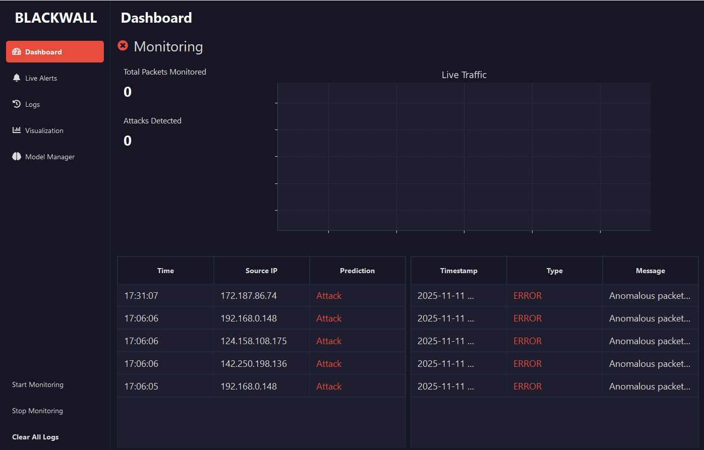

# Blackwall IDS


A modern, desktop-based Intrusion Detection System (IDS) that leverages Machine Learning to detect anomalous network behavior in real-time, including zero-day threats.


*(You should take a screenshot of your final application and save it as `dashboard_screenshot.png` inside the `assets` folder for this image to appear)*

---

## Table of Contents

- [What is Blackwall?](#what-is-blackwall)
- [Key Features](#key-features)
- [Tech Stack](#tech-stack)
- [Installation](#installation)
- [Usage](#usage)
- [Project Structure](#project-structure)
- [License](#license)
- [Authors](#authors)

## What is Blackwall?

Blackwall acts as a vigilant security guard for your network. It continuously monitors network traffic, and unlike traditional signature-based systems that only catch known threats, Blackwall uses an **anomaly-based detection engine**.

By first learning what your "normal" network traffic looks like, it can identify any activity that deviates from this baseline. This allows Blackwall to detect not only known attacks but also novel threats like **Zero-Day exploits** and sophisticated campaigns such as "Operation Triangulation."

## Key Features

-   **Real-Time Network Monitoring:** Captures and analyzes network packets live using Scapy.
-   **Machine Learning Engine:** Utilizes Scikit-learn to build and deploy a sophisticated anomaly detection model.
-   **Intuitive GUI:** A user-friendly and professional interface built with PyQt5, designed for clarity and ease of use.
-   **Live Dashboard:** Provides an at-a-glance overview of network status, including total packets monitored, attacks detected, and a live traffic graph.
-   **Traffic Visualization:** Displays a live distribution of network protocols (TCP, UDP, ICMP) to help users visually spot trends.
-   **Comprehensive Logging:** Stores all detected security events in a local SQLite database for historical analysis.
-   **In-App Model Training:** Users can capture their own network baseline and train a new detection model directly from the UI, tailoring Blackwall to their specific environment.

## Tech Stack

-   **Language:** Python
-   **GUI:** PyQt5
-   **Packet Capture:** Scapy
-   **Machine Learning:** Scikit-learn
-   **Data Visualization:** Matplotlib
-   **Database:** SQLite
-   **Packaging:** PyInstaller
-   **Icons:** qtawesome

## Installation

### For End-Users (Recommended)

1.  Download the `Blackwall.exe` from the project's [Releases](https://github.com/your-username/blackwall/releases) page.
2.  Move the executable to a desired location.
3.  **Right-click** `Blackwall.exe` and select **"Run as administrator"**. Administrator privileges are required for packet capture.

### For Developers

1.  **Clone the repository:**
    ```bash
    git clone https://github.com/your-username/blackwall.git
    cd blackwall
    ```

2.  **Important (Windows Users):** Install Npcap. Blackwall's packet sniffer (Scapy) requires this driver.
    -   Download and run the installer from the [official Npcap website](https://npcap.com/#download).
    -   During installation, make sure to check the box for **"Install Npcap in WinPcap API-compatible Mode"**.

3.  **Create and activate a virtual environment:**
    ```bash
    # Create the environment
    python -m venv venv

    # Activate it (Windows)
    .\venv\Scripts\activate
    ```

4.  **Install dependencies:**
    ```bash
    pip install -r requirements.txt
    ```

5.  **Run the application with administrator privileges:**
    -   **On Windows:** Open a new PowerShell/CMD **as Administrator**, navigate to the project folder, activate the venv, and run:
        ```powershell
        py main.py
        ```
    -   **On macOS/Linux:**
        ```bash
        sudo python main.py
        ```

## Usage

1.  **Launch Blackwall** with administrator rights.
2.  Navigate to the **Model Manager** tab.
    -   Click **"Start Capture"** to create a baseline of your normal network traffic.
    -   Once captured, click **"Train New Model"** to build a detection engine tailored to your system.
3.  On the sidebar, click **"Start Monitoring"**.
4.  View the **Dashboard** for a high-level summary.
5.  Go to the **Live Alerts** page to see suspicious activity detected in real-time.
6.  Analyze historical trends on the **Visualization** page and review all past events in the **Logs** tab.

## Project Structure